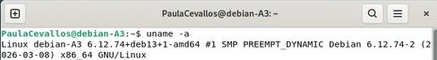
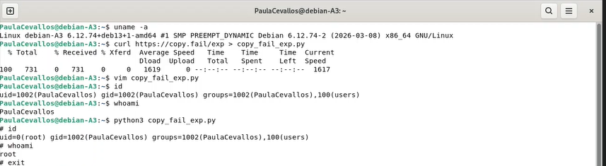
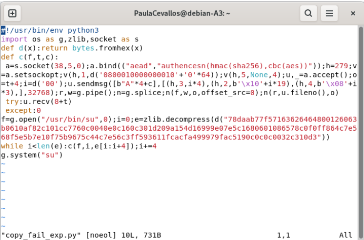
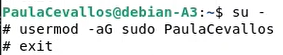
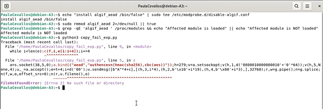
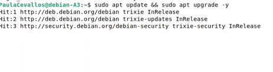
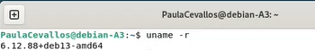

# Copy Fail — CVE-2026-31431 Lab
## Introducción a UNIX · UIDE · Evaluación Parcial 2 → 9 puntos

[](https://github.com/DOCENTE_REPO/copy-fail-challenge/actions/workflows/grade.yml)

---

Un bug lógico silencioso durante **casi una década** en el kernel Linux.
Un script de **732 bytes**. **Root** en todas las distribuciones mayores desde 2017.

Tu tarea: reproducirlo y parchearlo.

## Inicio rápido

```bash
# 1. Fork este repositorio a tu cuenta GitHub
# 2. Ábrelo en GitHub Codespaces
# 3. Dentro del devcontainer:

git config user.name "TuNombre TuApellido"
git config user.email "tu@uide.edu.ec"

make setup        # compila kernel vulnerable + rootfs (~20 min)
make qemu         # arranca la VM vulnerable

# ... sigue las instrucciones en CHALLENGE.md
```

## Estructura del repositorio

```
copy-fail-challenge/
├── .devcontainer/          ← Configuración del devcontainer (Ubuntu + QEMU)
│   ├── devcontainer.json
│   └── Dockerfile
├── .github/workflows/
│   └── grade.yml           ← Autocalificador de GitHub Actions
├── evidence/               ← TUS ARCHIVOS DE EVIDENCIA VAN AQUÍ
│   └── README.md
├── grader/
│   └── grade.py            ← Calificador local (make grade)
├── patches/                ← TU PARCHE VA AQUÍ (Hito 4)
│   └── README.md
├── scripts/
│   ├── 00_welcome.sh
│   ├── 01_build_kernel.sh  ← Compila Linux v6.12 (vulnerable)
│   ├── 02_build_rootfs.sh  ← BusyBox + Python rootfs
│   ├── 03_run_qemu.sh      ← Arranca la VM
│   └── 04_build_patched_kernel.sh
├── kernel/                 ← Fuentes del kernel (gitignore excepto config)
├── CHALLENGE.md            ← INSTRUCCIONES COMPLETAS DEL RETO
├── Makefile
└── README.md
```

## Hitos y puntuación

| # | Hito | Pts |
|---|------|-----|
| 1 | Kernel Linux 6.12 vulnerable corriendo en QEMU, `algif_aead` cargado | 2.0 |
| 2 | PoC ejecutado → `uid=0(root)` obtenido como usuario sin privilegios | 3.0 |
| 3 | Mitigación temporal: `rmmod algif_aead`, exploit falla | 1.5 |
| 4 | Parche en `crypto/algif_aead.c`, kernel recompilado, exploit falla | 2.0 |
| B | `REPORT.md`: explicación técnica con conexión a conceptos del curso | 0.5 |

## Recursos

- Write-up técnico: https://xint.io/blog/copy-fail-linux-distributions
- Sitio oficial del CVE: https://copy.fail/
- PoC público: https://github.com/theori-io/copy-fail-CVE-2026-31431
- Kubernetes escape (Parte 2): https://github.com/Percivalll/Copy-Fail-CVE-2026-31431-Kubernetes-PoC

## Reglas del examen

- ✅ Se permite todo recurso en internet, IA, documentación, write-ups
- ✅ Se permite (y se espera) leer el código del PoC público
- ❌ No se permite compartir archivos de evidencia entre estudiantes
- ❌ El hostname de tu VM debe ser único (viene de `git config user.name`)
- ⏱ Todos los commits deben tener timestamp dentro de la ventana del examen

---

*Basado en CVE-2026-31431 descubierto por Theori / Xint Code. Divulgado el 29 de abril de 2026.*


commit 1: corte 12:03
commit 3: corte 12:53

THIS EVALUATION HAS BEEN DONE ON A DEBIAN 13 VIRTUAL MACHINE (DEBIAN TRIXIE)

HITO 1:Vulnerable Linux Kernel (tested on Debian)

In here, we check for the kernel version using uname -a, and we can see the kernel 6.12.74, which is inside the critical range of the affected systems, because this specific kernel has the original logical fail in the cryptographic subsystem,  according to Team (2026). This is more than enough to verify the kernel is vulnerable.

HITO 2: Successful exploit using the .py archive containing malicious code.


In here, we can see the successful exploit, as we used curl to copy the information containing the archive directly from the internet (this is possible as the debian VM is connected to the internet). We first check we have our own id and executing whoami shows us the name (in this case PaulaCevallos). But when we execute the exploit, we can see that we have become root.

HITO 3: Temporal mitigation

note: To guarantee effective mitigation in a production-ready environment prior to applying a permanent source-code patch (Milestone 4), running rmmod alone is insufficient. It is mandatory to enforce a module blacklist rule within /etc/modprobe.d/ to legally forbid the kernel from autoloading the driver, combined with flushing the corrupted memory using the /proc/sys/vm/drop_caches directive.

Ironically, before we put in the commands, we need sudo access given to the specific user, in my case PaulaCevallos, so I'll use the exploit (that we have not yet patched up lol) to give myself sudo access, then, I'll reestart the VM:


as we can see, we executed the following commands:
echo "install algif_aead /bin/false" | sudo tee /atc/modprobe.d/disable-algif.conf
sudo rmmod algif_aead 2>/dev/null || true
grep -qE 'algif_aead ' /proc/modules && echo "Affected module is loaded" || echo "Affected module is NOT loaded"

The first command disables the algif_aead module from being automatically reloaded by the system kernel. It uses echo to output a specific string configuration rule, which states that any attempt to install or load this specific module should run /bin/false (a command that does nothing and immediately fails) instead. This output string is redirected via a pipe (|) into the tee command, which runs with administrative root privileges via sudo. The tee utility writes this configuration string directly into a new configuration file located at the absolute path /etc/modprobe.d/disable-algif.conf, ensuring the kernel enforces this loading restriction.

The second command immediately forces the active kernel to drop and unload the target module from the running system memory. It runs the rmmod (Remove Module) utility elevated with root privileges via sudo and passes algif_aead as the specific argument to target. To keep the script execution clean, standard error output (stderr) is redirected using 2> to the null device (/dev/null), which permanently discards any annoying error messages if the module was already absent. Finally, the conditional OR operator (||) hooks into the true utility, ensuring that even if the removal command fails, the entire shell line evaluates as a successful execution so automation scripts do not halt.

The third command acts as a validation script to dynamically check whether the module remains active in the system runtime environment. It employs the grep utility with the quiet flag -q to suppress screen output and the extended regular expression flag -E to search for the specific pattern 'algif_aead ' inside the virtual file /proc/modules, which tracks all active kernel components. If grep finds a match, the logical AND operator (&&) triggers an echo command that prints "Affected module is loaded". If no match is found, the logical OR operator (||) acts as an else clause, executing an alternative echo command that prints "Affected module is NOT loaded" to confirm successful mitigation.

HITO 4: Permanent fix

In this case, since I am working in a Virtual Machine (Debian VM), the reboot of the system, but before that, we have to put in these two commands:
sudo apt update && sudo apt upgrade -y
sudo reboot
The first command completely updates the virtual machine's software packages. It starts with `sudo apt update` to download the latest package lists from the repositories so the system knows what updates are available. The `&&` operator ensures that if the update succeeds, the shell immediately runs `sudo apt upgrade -y`, which downloads and installs the actual software and security updates, using the `-y` flag to automatically answer "yes" to all installation prompts.

The second command, `sudo reboot`, immediately restarts the virtual machine with administrative privileges. This forces the system to gracefully close all running services and reboot the operating system, which is required to apply the newly installed software dependencies and load the updated Linux kernel cleanly into memory.

Then, after all is done, we will check our kernel version to verify the changes:

    here, we can see that the new kernel is in the version 6.12.88 (non-vulnerable), as opposed to the initial kernel version of 6.12.74 (vulnerable).

Team, M. D. S. R. (2026, 2 mayo). CVE-2026-31431: Copy Fail vulnerability enables Linux root privilege escalation across cloud environments. Microsoft Security Blog. https://www.microsoft.com/en-us/security/blog/2026/05/01/cve-2026-31431-copy-fail-vulnerability-enables-linux-root-privilege-escalation/